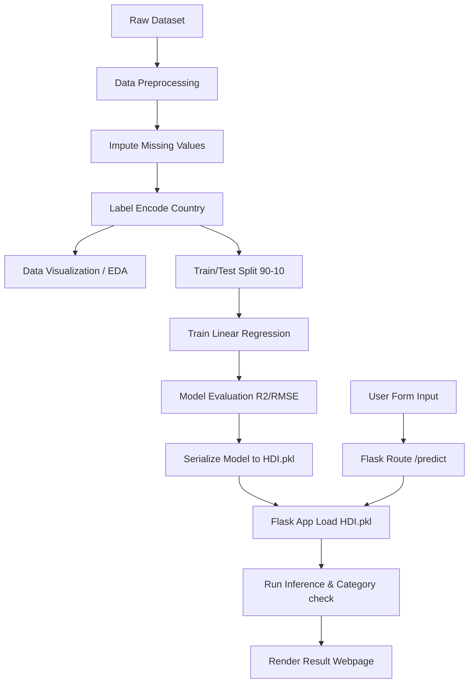

# Human Development Index (HDI) Prediction
### A Comprehensive Measure of Well-Being

This repository houses a production-quality machine learning project that predicts the **Human Development Index (HDI)** using a **Linear Regression** model and deploys it as a premium, highly interactive **Flask web application**.

The project is developed as part of the SkillWallet internship program and adheres to strict modular design and PEP8 code quality standards.

---

## Table of Contents
1. [Project Overview](#project-overview)
2. [Problem Statement](#problem-statement)
3. [Architecture & Workflow](#architecture--workflow)
4. [Folder Structure](#folder-structure)
5. [Installation & Setup](#installation--setup)
6. [Running Model Training](#running-model-training)
7. [Running the Flask Web App](#running-the-flask-web-app)
8. [Running Verification Tests](#running-verification-tests)
9. [Screenshots & Visualizations](#screenshots--visualizations)
10. [Future Improvements](#future-improvements)
11. [License](#license)

---

## Project Overview
The Human Development Index (HDI) is a statistical composite index created by the United Nations Development Programme (UNDP) to measure and rank countries' social and economic development levels. It assesses three basic dimensions of human development:
- **A long and healthy life**: Measured by Life Expectancy at birth.
- **Knowledge/Education**: Measured by Average Years of Schooling.
- **A decent standard of living**: Measured by Gross National Income (GNI) per capita.

Additionally, this project incorporates **Internet usage** statistics to evaluate the digital gap and technological inclusion as modern catalysts for development.

This project implements the end-to-end Machine Learning lifecycle:
1. Automated dataset acquisition and caching.
2. Robust data preprocessing (mean imputation for nulls, label encoding for countries).
3. Exploratory Data Analysis (EDA) visualizations.
4. Linear Regression model training and evaluation ($R^2$ score: **0.954**).
5. Serialization and deployment inside a responsive dark-themed Flask web app.

---

## Problem Statement
Traditional economic indicators like GDP focus purely on market activity and ignore the human aspect of progress. The HDI provides a holistic view of country progress, but manual computation of HDI rankings can be complex. 

This project aims to automate and predict country well-being values dynamically using machine learning techniques based on basic development inputs, enabling policy makers to simulate changes in education or health and study their direct impact on overall HDI values.

---

## Architecture & Workflow

### Modular Architecture
The repository uses a highly modular design to decouple training and application deployment layers:
- **Training Pipeline**: Decoupled into `preprocessing.py`, `visualization.py`, and `model.py` which are orchestrated by `train.py`.
- **Jupyter Workspace**: An interactive walkthrough notebook `HumDevIndex.ipynb` is included for rapid exploration.
- **Flask Deployment**: The app loading logic, route orchestration, input validation, and categorization are handled in `app.py`.
- **Pickle Interface**: The serialized model and metadata (`HDI.pkl`) serve as the contract/interface between the Training and Web App layers.

### System Workflow


---

## Folder Structure

```
HDI-Prediction/
│
├── Dataset/
│     └── HDI.csv              # Raw dataset (downloaded automatically if missing)
│
├── Training/
│     ├── HumDevIndex.ipynb    # Jupyter walkthrough of training Epics
│     ├── train.py             # Orchestration script to run preprocessing & training
│     ├── preprocessing.py     # Utilities for loading, imputation, and label encoding
│     ├── visualization.py     # Functions for heatmaps, strip, and scatter plots
│     ├── model.py             # Model training, scoring, and pickle serialization
│     └── static/
│           └── images/        # Local visualization outputs directory
│
├── Flask/
│     ├── app.py               # Flask application server
│     ├── HDI.pkl              # Serialized trained model and metadata
│     │
│     ├── templates/
│     │     ├── home.html      # Landing Page (Explaining HDI)
│     │     ├── indexnew.html  # Prediction Form
│     │     └── result.html    # Outcome page (displays HDI score & category)
│     │
│     └── static/
│           ├── css/
│           │    └── style.css # Custom Glassmorphism Dark Theme styling
│           ├── js/
│           │    └── main.js   # Interactive form range validators
│           └── images/
│                └── (exploratory plots copied here for front-end rendering)
│
├── requirements.txt           # Declared python package dependencies
├── test_app.py                # Automated Flask route unit tests
├── LICENSE                    # MIT License
└── .gitignore                 # Files/folders to exclude from git tracking
```

---

## Installation & Setup

1. **Clone the Repository**:
   ```bash
   git clone https://github.com/Sankar7567/measure_of_well_being.git
   cd measure_of_well_being
   ```

2. **Create and Activate a Virtual Environment**:
   ```bash
   python3 -m venv venv
   source venv/bin/activate
   ```

3. **Install Dependencies**:
   ```bash
   pip install -r requirements.txt
   ```

---

## Running Model Training

Execute the training script to download the dataset, perform preprocessing, output plots, evaluate metrics, and package the model:
```bash
python Training/train.py
```

Upon running, you should expect output summarizing data shapes, imputations, and regression metrics:
```text
Loaded dataset successfully. Shape: (195, 82)
Imputed missing values in numeric indicators...
Model trained. 
R² Score: 0.954099
RMSE:     0.030772
Model saved to Flask/HDI.pkl
```

---

## Running the Flask Web App

Start the Flask web app locally:
```bash
python Flask/app.py
```
Open your browser and navigate to `http://127.0.0.1:5000/`.

- **Home Page (`/`)**: Explains the history, structure, and dimensions of the Human Development Index.
- **Form Page (`/Prediction`)**: Allows user to input parameters and select a country from the dropdown menu.
- **Result Page (`/predict` - POST)**: Displays the calculated index value and categorization level:
  - **Low HDI** ($\ge 0.1$ and $\le 0.4$)
  - **Medium HDI** ($> 0.4$ and $\le 0.7$)
  - **High HDI** ($> 0.7$ and $\le 0.8$)
  - **Very High HDI** ($> 0.8$ and $\le 0.96$)

---

## Running Verification Tests

To verify routes, error handling, redirection, and model inference compatibility, run the unit test suite:
```bash
python test_app.py
```

---

## Screenshots & Visualizations

During training, the pipeline generates high-quality exploratory visualizations saved to `Flask/static/images/`:

1. **Correlation Matrix**: Analyzes the linear relationship between development indicators and HDI.
2. **Distribution of HDI**: Visualizes the density distribution of global HDI scores.
3. **Strip Plots**: Showcases how schooling and life expectancy correlate with HDI scores for individual countries.
4. **Actual vs Predicted**: Visualizes regression residuals on test data.

---

## Future Improvements
- **Alternative Algorithms**: Explore Random Forest Regressor and Gradient Boosting to capture non-linear relationships.
- **Feature Expansion**: Incorporate Gini Coefficient (inequality indicator) and CO2 emission rates for eco-development indexing.
- **Time Series Forecasting**: Implement LSTM networks to predict future HDI trends for a specific country over the next decade.

---

## License
Distributed under the MIT License. See [LICENSE](LICENSE) for details.
